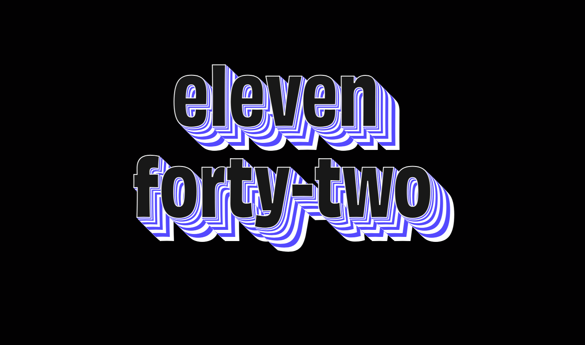

# Wordy Clock

A clock, but with words.

SEE IT HERE: [https://brandicameron.github.io/wordy-clock/](https://brandicameron.github.io/wordy-clock/)

---

---

## Things Learned:

- Switch statements.
- Working with time. (obviously 🙄 )
- Multiple drop shadows.
- CSS Variables
- Changing css variables in javascript.

---

## Author

Brandi Cameron

[hello@brandicameron.com](mailto:hello@brandicameron.com) | [www.brandicameron.com](https://brandicameron.com/)
